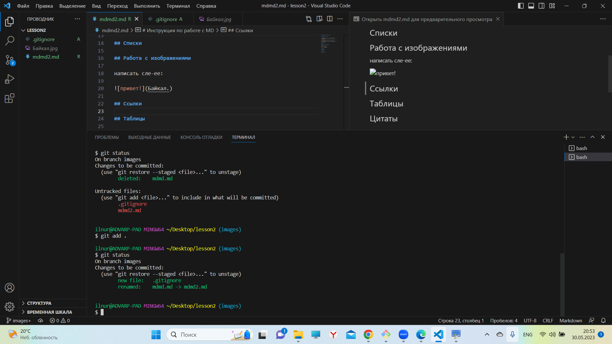

# Туториал по основам системы контроля версий GIT


## Инициализация проекта
**Чтобы добавить возможность использовать разные версии файлов, необходимо использовать следующую команду:**

```fix
git init
```


## Как добавить файл в отслеживание
**Чтобы добавить файл на отслеживание, используйте следующую команду:**

```
git add .
```


# Инструкция-туториал по разметке MarkDawn


## Заголовки


## Исходный код 


## Таблицы


## Изображения

**Чтобы добавить изображения, воспользуйтесь следующей командой:**

```

```
Пример:


**Если свое фото - то указываем его название:**

